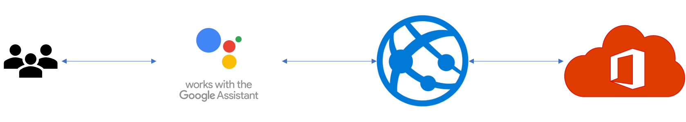

# RoomFinder
This is demo project for booking meeting room in Office 365 Tenant by Google Assistant (Home).

## What you can learn
- How to setup OAuth authentication for [Microsoft Graph](https://developer.microsoft.com/en-us/graph) in [Dialog Flow](https://dialogflow.com/)
- How to book meeting room through Microsoft Graph

## Current version limitation
- Haven't implemented the function to find available room in room list. You can implement it with following 2 APIs.
    1. Get meeting rooms with [findRoomLists API](https://developer.microsoft.com/en-us/graph/docs/api-reference/beta/api/user_findroomlists) and [findRooms API](https://developer.microsoft.com/en-us/graph/docs/api-reference/beta/api/user_findrooms).
    2. Find available foom with [findMeetingTimes API](https://developer.microsoft.com/en-us/graph/docs/api-reference/v1.0/api/user_findmeetingtimes) or [List events API](https://developer.microsoft.com/en-us/graph/docs/api-reference/v1.0/api/user_list_events)
- No test.. sorry

# Solution description
## Current Architecture


## Prerequisites
- Install [Node.js](https://nodejs.org/en/) in your development environment. I assume you can understand es6.
- Basic TypeScript knowledge. Please learn from [tutorial document](https://www.typescriptlang.org/docs/handbook/typescript-in-5-minutes.html)
- I assume you have O365 tenant. If you want to try O365, you can try trhough [Free trial] in [product page](https://products.office.com/en/business/office-365-enterprise-e3-business-software)
- In addition to it, I assume you have meeting room as resource mail box in O365 tenant. If you dont't have it, you can make it with [this document](https://support.office.com/en-us/article/room-and-equipment-mailboxes-9f518a6d-1e2c-4d44-93f3-e19013a1552b#ID0EABAAA=Set_it_up)

## How to setup
For OAuth authentication, need to register app and pickup `Client ID` and `Client Secret`. In addition to it, need to set redirect url and scope. You can learn how to setup with following section.

### Register app in Microsoft App registration portal
1. Register(create) new app in the [app registration portal](https://apps.dev.microsoft.com/) with [this document](https://developer.microsoft.com/en-us/graph/docs/concepts/auth_register_app_v2). Please save your `Applicaion Id(Client ID)` and `Password(Client Secret)` in the clipboard.
2. Add platform as `Web` with [Add Platform]button.
3. Paste `https://oauth-redirect.googleusercontent.com/r/<Your project id>` in the [Redirect URLs]text box.
4. Add `Calendars.ReadWrite.Shared` and `User.Read` delegated permissions in the [Microsoft Graph Permissions]section.
5. Save your change.

### Setup Dialog flow (Basic)
- [Play around to build your first agent](https://dialogflow.com/docs/getting-started/building-your-first-agent) and try to [use Fulfillment](https://dialogflow.com/docs/getting-started/basic-fulfillment-conversation). You will update Webhook url later.
-  Please set `reserve.room` as action name. It need to support Fulfillment.


### Setup Dialog flow (Authentication)
[Implementing Account Linking](https://developers.google.com/actions/identity/account-linking) with following parameters.

|Property name|Value|
|:---|:---|
|Grant type|Authorization code|
|Client ID|Application Id generated in app registration portal|
|Client secret|Password generated in app registration portal|
|Authorization URL|https://login.microsoftonline.com/common/oauth2/v2.0/authorize|
|Token URL |https://login.microsoftonline.com/common/oauth2/v2.0/token|
|Scopes|https://graph.microsoft.com/Calendars.ReadWrite.Shared https://graph.microsoft.com/User.Read|

*Important*: You need to turn on [Sign in required] in the [Integration menu] in [dialog flow console](https://console.dialogflow.com).

## How to run
1. `git clone https://github.com/NT-D/RoomFinder.git`
2. `npm install` in terminal(or command prompt) for installing node modules
3. `npm run watch` in another terminal for trans-complie .ts to .js file
4. `npm run start` in terminal for starting app.
5. Setup [ngrok](https://ngrok.com/) and create forwarding url (ex. You will get the url like https://c349cad0.ngrok.io)
6. [Set previous url in the Fulfillment settings](https://dialogflow.com/docs/getting-started/basic-fulfillment-conversation#enable_webhook_in_dialogflow) in dialog flow.

## Implementation description
### How to get access token
You can get access token through this code in `app.ts`.
```javascript
dialogApp.getUser().accessToken
```

### Call MS Graph by app
You can call graph API like this code in `msgraphService.ts`.
```javascript
export async function getUserInfo(accessToken: string): Promise<msGraph.User> {
    const response = await fetch(`${apiEndpointUrl}/me`, { method: 'GET', headers: { 'Authorization': `Bearer ${accessToken}` } });
    return await response.json() as msGraph.User;
}
```

# Userful resources
- [Samples and Libraries for Actions on Google](https://github.com/actions-on-google)
- [Get started with Microsoft Graph in a Node.js app](https://developer.microsoft.com/en-us/graph/docs/concepts/nodejs)
- [MS Graph Types](https://github.com/microsoftgraph/msgraph-typescript-typings)
- [Time zone lists](https://docs.microsoft.com/en-us/windows-hardware/manufacture/desktop/default-time-zones)
- [Get started with Microsoft Graph in a Node.js app](https://developer.microsoft.com/en-us/graph/docs/concepts/nodejs)
- [Create Event in MS Graph](https://developer.microsoft.com/en-us/graph/docs/api-reference/v1.0/api/user_post_events#request-headers)